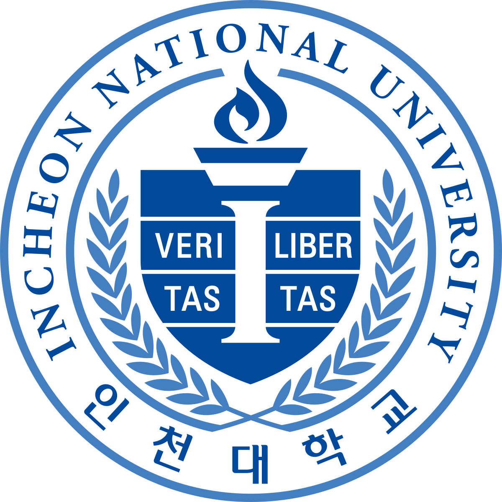
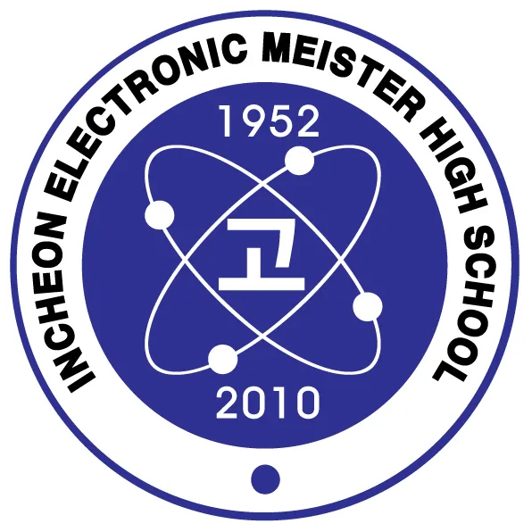

## Career

<b>Samsung Advanced Institute of Technology (SAIT) - Device Lab (22.05 ~ recent)</b>  
 

Huneed Technologies - Quality Assurance (18.02 ~ 22.02)

## Academic

<b>Incheon National University - Computer Engineering</b>  

Incheon Electronic Meister High School - Electrical Engineering

## Study
<b>DUJJEX (Samsung internal Group)</b> 
- n8n(web code automation tool) development using TS, nodejs, Docker

## Honors & Awards
<b>삼성전자 SAIT 2024 DX Hackathon Consest 우승 (1st grade) 24.12.12</b>

<b>인천대학교 Code festival 2024 동상 수상 24.09.26</b>

<b>인천대학교 컴퓨터공학부 졸업작품(캡스톤프로젝트) 수상 24.05.31</b>
 
- Project: GreenWalk (팀명: Codehanzoom, 코드한줌)
- Position: 안드로이드 개발, 프로젝트 기획, 프로젝트 발표
- Repo: https://github.com/CodeHanZoom/greenwalk_android

<b>인천대학교 AI 아이디어 경진대회 4TH 23.11</b>
 
- Subject: 전염병의 전파속도와 전파경로 예측 (팀명: 우와한 형제)
- Position: 아이디어 기획, 아이디어 발표
- Presentation material: https://github.com/MCYJ/MCYJ.github.io/blob/main/Idea.AIContest/%EC%A0%84%EC%97%BC%EB%B3%91%EC%9D%98%20%EC%A0%84%ED%8C%8C%EC%86%8D%EB%8F%84%EC%99%80%20%EC%A0%84%ED%8C%8C%EA%B2%BD%EB%A1%9C%EC%98%88%EC%B8%A1.md
