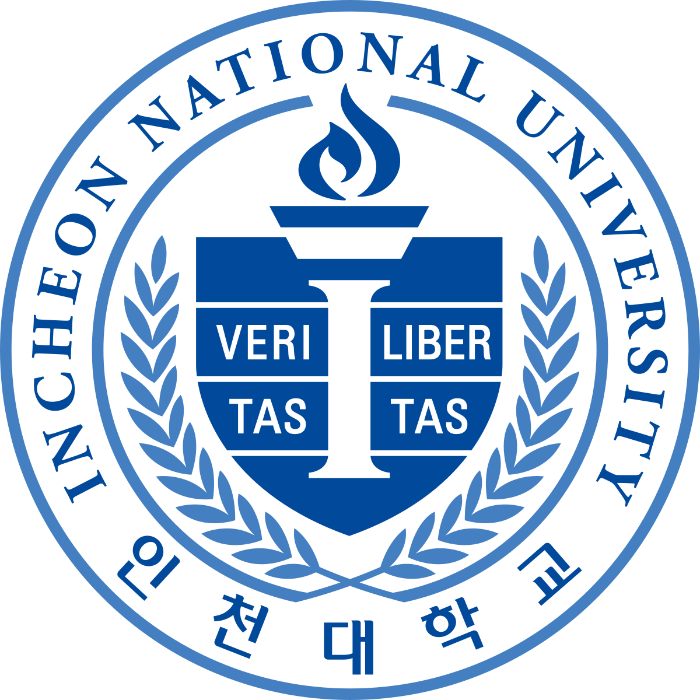

## Career

<b>Samsung Advanced Institute of Technology (SAIT) - Device Lab (22.05 ~ recent)</b>  
 

Huneed Technologies - Quality Assurance (18.02 ~ 22.02)

## Academic

<b>Incheon National University - Computer Engineering</b>  

## Honors & Awards
<b>삼성전자 SAIT 2024 DX Hackathon Consest 우승 (1st grade) 24.12.12</b>
